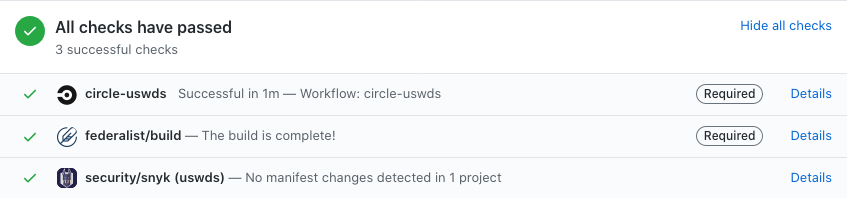

# Contributing to USWDS

What it's like to work with and contribute to the
[USWDS](https://github.com/uswds/uswds) framework.

## Repo's you should know
When you visit the [USWDS organization](https://github.com/uswds) you'll find a bunch of repo's.


As a dev, you'll mostly be working in:
- [USWDS](https://github.com/uswds/uswds)

  Where the actual framework code lives.
- [USWDS-Site](https://github.com/uswds/uswds-site)

  The site code for the [website](https://designsystem.digital.gov/)

- [USWDS Gulp](https://github.com/uswds/uswds-gulp)

  Helps dev get set up locally to compile and use the framework. In case they don't have a local build system or don't want to be bothered creating one.

- [USWDS for Designers](https://github.com/uswds/uswds-for-designers)

  Occasionally you'll need to pull and review the Sketch file to make sure everything syncs up with component development.


## The framework (USWDS)

Where things live and what they are.

### File structure

```
.
├── .circleci
├── .github
├── config/
├── docs/
├── examples/
├── spec/
├── src/
├── .browserslistsrc
├── .codeclimate.yml
├── .editorconfig
├── .eslintignore
├── .eslintrc.yml
├── .gitignore
├── .npmignore
├── .nvmrc
├── .prettierignore
├── .snyk
├── .stylelintrc.json
├── CONTRIBUTING.md
├── LICENSE.md
├── README.md
├── _config.yml
├── fractal.config.js
├── gulpfile
├── package-lock.json
├── package.json
└── tsconfig.json
```
There are a few standout directories that you should know. They are listed below.

#### config

Holds the gulp tasks that `gulpfile.js` consumes. Also has a `nycrc.yml` file, but not sure what that does.

#### docs
Holds who is using uswds, but this seems to be outdated and no longer maintained.

> We should update this directory to give users the best possible documentation.

#### examples
How USWDS lives alongside other tech. There's an existing [angular](https://github.com/uswds/uswds/issues/3341) setup that might be worth importing.

> Also needs updating.

#### spec

Most things related to testing. Our unit tests, visual regression screenshots, and accessibility testing, and our setup for a headless chrome instance live here.

> We should organize this.

#### src
The framework source code. Fonts, img, js, stylesheets get compiled and built out into a `dist/` folder that users and themers  recognize.

The other directories are for internal use, they are:

##### data

Color tokens used in generating a SASS version the framework uses.

> We should see how we can feed these tokens to USWDS-Site so we have one single source of truth.

##### components
Component code ([nunjucks ↗](https://mozilla.github.io/nunjucks/) files) that [Fractal ↗](https://github.com/frctl/fractal) (component library) will consume to display components. These compiled components will also be fed to USWDS-Site. Here's an example of [that](https://github.com/uswds/uswds-site/blob/b17f6da97fff8a6358c190e266878a021f3f5b55/_includes/code/components/card.html#L4). Which gets used in the documentation page of the [card](https://github.com/uswds/uswds-site/commit/1a078913d35473982dcdafec1301db48193e8c0e#diff-a4c5956cc2ee5dc95b24edcbf09a7cfcR13).

## Git conventions

The main branch for USWDS is `develop`. This is the most up-to-date version. The most stable version is `master` which gets packaged and pushed to node for every release.

For your own work the standard convention is your initials and then the problem you're trying to solve.

For example if I want to add RDFa tags to the breadcrumb markup. It'd look like this:

```bash
jm-breadcrumb-add-rdfa
```

If you're working on component development. Create a branch based off of master called:

```bash
add-{{ componentName }}-component

// ex:
add-card-component
add-breadcrumb-component
```

Then you'll branch off of this newly created branch and start development work on your new component.

### A PR is a blog post
Try to add as much detail to your Pull Request as possible. If you've added or removed settings be sure to document those and why.

For example, this [Update banner settings](https://github.com/uswds/uswds/pull/3520) PR is a good example of what kind of information to include.

### Create a draft PR
Create a draft PR to let your peers be able to contribute and test features. You also get a preview link that will let less technical people view your work.

Once your code successfully passes CI tests go back and update your original PR with a preview link.

## CI Process

Tasks are defined in `.circleci` directory. When you commit and submit PR's to USWDS and USWDS-Site you'll see some checks are run. If they're all green then your PR should be good to review and merge. If not, you have to resolve the errors before.



#### circle-uswds
Checks for build errors.

#### federalist/build
Will give you a preview link for fractal (component library) like [this ↗](https://federalist-3b6ba08e-0df4-44c9-ac73-6fc193b0e19c.app.cloud.gov/preview/uswds/uswds/jm-component-breadcrumb/components/detail/breadcrumb--default.html) or a preview of the website with your changes like [here ↗](https://federalist-ead78f8d-8948-417c-a957-c21ec5617a57.app.cloud.gov/preview/uswds/uswds-site/jm-card-component-docs/components/card/).

#### security/snyk
A plugin we use to scan for vulnerabilities in our dependencies. These checks usually pass if you keep your dependencies up-to-date. In the rare cases there are no patches available you can opt to ignore warnings for 30 days, but speak to someone first.

## Creating Issues

USWDS has a template for creating issues in USWDS & USWDS-Site. You can find that template [here ↗](https://github.com/uswds/uswds/blob/develop/.github/ISSUE_TEMPLATE.md).

⚠️ When you visit it you'll see it's using the old template workflow. Ideally we'd want to use the new workflow **and** have templates for things like Feature Requests and Bugs.

## Developing Components

It's important to try to follow the CARED framework for developing components.

<details>
 <summary><strong>CARED Framework</strong></summary>

  - **C** | Clear
    - [ ] Demonstrated reason for existing
    - [ ] Fulfills distinct user need
    - [ ] Distinguished from existing components
    - [ ] Obvious/intentional in finish and functionality
  - **A** | Accessible
    - [ ] Section 508 AA conformant
    - [ ] Documented any possible accessibility blind spots
    - [ ] Passes automated checks
  - **R** | Resilient
    - [ ] Performs well on all devices
    - [ ] Performs well in all supported browsers
    - [ ] Works if Javascript is disabled
    - [ ] Performs regardless of position on the page
    - [ ] Isolated: Properly uses BEM
    - [ ] Performs well with outlier content (long or short text)
    - [ ] Performs well regardless of typeface
    - [ ] Prioritizes modularity
  - **E** | Efficient
    - [ ] Starts from existing solutions
    - [ ] Uses USWDS tokens
    - [ ] Works with existing codebase or improves performance of entire codebase
    - [ ] Requires as little refactoring as possible
    - [ ] Requires as little migration effort as possible
  - **D** | Documented
    - [ ] Usability testing synthesis (ie what did you learn from research?)
    - [ ] Implementation guidance
    - [ ] Migration guidance
    - [ ] Usability guidance
    - [ ] References
</details>

The development lifecycle we've developed for Breadcrumb and Card have been like this:

⚠️ Note: this isn't perfect and we should work towards improving this process.

#### The process

```
.
├── UX       → Research, landscape analysis, develop guidance
├── UX*      → Prototyping in Codepen
├── Dev      → Recreate within USWDS, create draft PR.
├── QA       → Test for accessibility.
├── UX & Dev → Develop possible settings for component
├── Dev      → Incorporate those settings
└── Dev      → Keep iterating until we have a good baseline for release.
               Document all of the settings. Update USWDS-Site Documentation.

* Dev can do this too, depends on skillset
```

#### UX

Add your research and landscape analysis to tickets. Generally we've added drafts of Component guidance (what eventually becomes the component page) on the wiki.

You can view an example of that [here](https://github.com/uswds/uswds/wiki/Card-Landscape-Analysis). And it's related [issue](https://github.com/uswds/uswds/issues/3161).

Once this has been completed, tied to issues, and reviewed by the team we can start prototyping. We've done prototyping in Codepen for [breadcrumb](https://codepen.io/pglevy/pen/oNjBBow?editors=1100) and [Card](https://codepen.io/collection/DOOBJG). When this is in a good state we can start dev work and prototyping it in USWDS.

#### Starting development

Create a branch from develop for this new component. This would be something like:

```
add-{{ component-name }}-component
```
This will be the official branch that gets merged into `develop`.

Then create branch from that newly created branch and start development. You'll PR your branch against `add-newComponent-component`.

For example:

```
add-breadcrumb-component ← jm-add-breadcrumb
                           jm-breadcrumb-prototype
                           jm-add-breadcrumb-settings
                           jm-cleanup-breadcrumb-examples
                           etc
```

Typical files involved:
```
//
// Markup for component development and testing
//
src/components/yourComponent/yourComponent.njk
src/components/yourComponent/yourComponent.config.yml
src/components/test/

//
// Styling component, defining defaults, and settings for users to modify. As well as creating package.
//
src/stylesheets/components/_yourComponent.scss
src/stylesheets/packages/_uswds-components.scss
src/stylesheets/packages/_yourComponent.scss
src/stylesheets/settings/_settings-components.scss
src/stylesheets/theme/_uswds-theme-components.scss
```

The workflow:

- [ ] [Create component issue](https://github.com/uswds/uswds/issues/3452)
- [ ] Create base branch
- [ ] [Create prototype](https://github.com/uswds/uswds/pull/3451)
- [ ] [Create settings](https://github.com/uswds/uswds/pull/3451/commits/8a61cb6d78142ef768638ea84538ac25054d4237)
- [ ] [Cleanup and finalize](https://github.com/uswds/uswds/pull/3488)
- [ ] [Add documentation](https://github.com/uswds/uswds-site/pull/967)
- Merge USWDS PR into develop and prep for release

When you're ready to merge in the component into develop you need to make sure you've done a few things.

Make sure you update the original `add-component` PR with all of the appropriate documentation. Good examples can be seen with [Card ↗](https://github.com/uswds/uswds/pull/3430) and [Breadcrumb ↗](https://github.com/uswds/uswds/pull/3488).

> ℹ You'll see that a lot of the content in that PR is checked against the CARED model criteria we have above. We want to be able to create a history of the development cycle. This way users have a time capsule of the process and can model this to contribute back.

#### Update USWDS-Site
Go to `USWDS-Site` repo and create a branch off of master. Change the `USWDS` version to the component branch.

Ex:
```bash
git checkout -b jm-add-breadcrumb-guidance
npm i -D "uswds/uswds#add-breadcrumb-component"
npm run start
```

Here you'll need to update [Documentation ↗](https://designsystem.digital.gov/documentation/settings/#components) & create the [component page ↗](https://designsystem.digital.gov/components/) with the component guidance.

Files modified
```
_data/variables.yml                         // Variables for settings page.
_components/newComponent.md                 // Guidance page based on Landscape analysis.
_data/nav.yml                               // Add component to Components nav
_includes/code/components/newComponent.html // Will consume fractal component from USWDS. This is why we need to change USWDS branches.
pages/ui-components/overview.md             // In a separate test repo measure the weight of your new component code and document here.
```

Make sure first entry for `_data/variables.yml` has `section: true`.
Example:
```yml
- name: Card
  section: true
  subsection: Border Color
  description: Stroke color of card.
  var: $theme-card-border-color
  default: "'base-lighter'"
- name: Card
  subsection: Border Radius
  var: $theme-card-border-radius
  default: "'lg'"
```

## Releasing
You can find the full release process documented [here ↗](https://github.com/uswds/uswds/wiki/Release-process).

Stick to semantic versioning. Create a release branch from `develop` to merge in to `master`. Here's a good [example](https://github.com/uswds/uswds/pull/3516) of what a release PR looks like.
